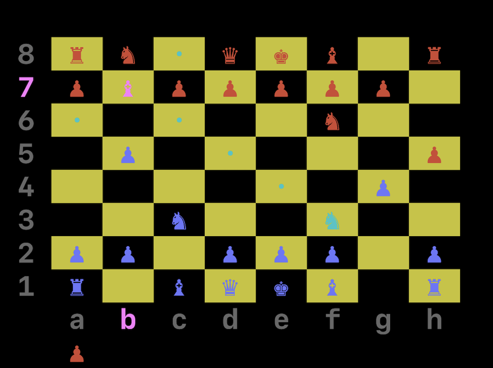

# chess.py

[Board games collection repo](https://github.com/956MB/board-games)

```
8  ♜  ♞  ♝  ♛  ♚     ♞  ♜    R N B Q K e N R
7  ♟  ♟  ♟  ♟     ♟  ♟  ♟    P P P P e P P P
6              ♟             e e e e P e e e
5                            e e e e e e e e
4     ♝        .             e B e e e e e e
3  ♞     ♟                   n e p e e e e e
2  ♟  ♟     ♟  ♟  ♟  ♟  ♟    p p e p p p p p
1  ♜     ♝  ♛  ♚  ♝  ♞  ♜    r e b q k b n r
   a  b  c  d  e  f  g  h 
         
⭠ ⭡⭣ ⭢  to move.
SPACE to select.
BACKSPACE to deselect.
ESC to exit.
```

Usage:

```
$ ./play.py -h

usage: play.py [-h] [-V] [-s [{0,1}]] [-t] [-d]

Play Chess in the terminal. Written in Python.

optional arguments:
  -h, --help            show this help message and
                        exit
  -V, --version         show script version
  -s [{0,1}], --starter [{0,1}]
                        set starting piece.
                        Blue/Red (0, 1)
  -t, --touch_move      set "Touch-move" rule on ON
  -d, --show_debug      set "Show Debug" option on
                        ON
```

